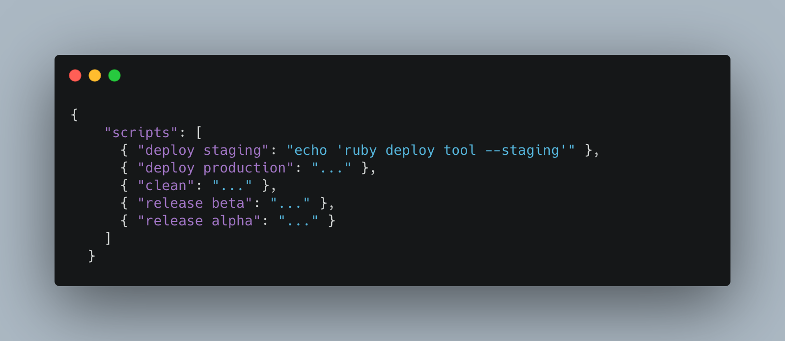
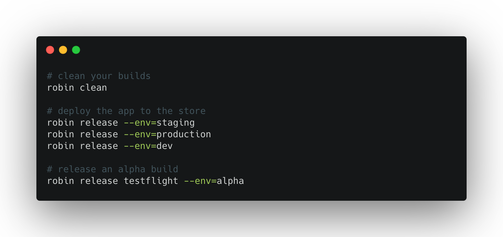

# robin
> Run scripts for any project


<!-- Transform a .json file
<p align="center">
  
</p>

Into a cli -->
<p align="center">
  
</p>

[](https://travis-ci.org/cesarferreira/robin)
[](https://www.npmjs.com/package/robin)
[](https://www.npmjs.com/package/robin) 

## Reason
> Every project has a different way of deploying/releasing/etc
. By maintaining a simple json file with all the available tasks for this project everyone on the team can add / edit the available tasks for the project.


### Sharing is caring?
> add it to `.gitignore` or share it with the team

 ## Usage

```sh
robin init # Creates an empty .robin.config.json
```
Generates this file:
<!-- We can be smart and insert deploy prod if we detect it's flutter, has fastlane? we can pre-populate -->
`.robin.config.json`

```json
{
    "scripts": {
      "deploy staging": "echo 'ruby deploy tool --staging'",
      "deploy production": "...",
      "clean": "...",
      "release beta": "...",
      "release alpha": "..."
    }
  }
  
```

Example: 
```sh
robin release beta # Would run your script to release your app to beta
robin deploy staging # Would deploy your server to staging environment
```
--------------

```sh
robin list # Lists all the available commands
```
--------------

```sh
robin add # Adds a command
```

Example: 
```sh
robin add "deploy" "fastlane deliver --submit-to-review" # Adds a deploy command to your current list of commands
```

-----------
## Ideas

## Passing params

This config:
```json
{
    "scripts": [
      "clean": "flutter clean && rm-rf ./output/",
      "release": "ruby deploy_tool --{{env}}'",
      "release testflight": "fastlane ios release -e={{env}}'",
    ]
}
```  

Would make this possible:
```sh
# clean your builds
robin clean

# deploy the app to the store
robin release --env=staging
robin release --env=production
robin release --env=dev

# release an alpha build
robin release testflight --env=alpha
```


### Search

Giving the `.robin.config.json`:

```json
{
    "scripts": {
      "deploy staging": "echo 'ruby deploy tool --staging'",
      "deploy production": "...",
      "clean": "...",
      "release beta": "...",
      { "release alpha": "..." }
    ]
  }
  
```

Writing: 
```sh
robin deploy 
```

Will suggest:
- `robin deploy staging`
- `robin deploy production`

Unless there's a `robin deploy` in your scripts list

## Install

```sh
npm install -g robin
```

## Created by
[Cesar Ferreira](https://cesarferreira.com)

## License
MIT © [Cesar Ferreira](http://cesarferreira.com)
