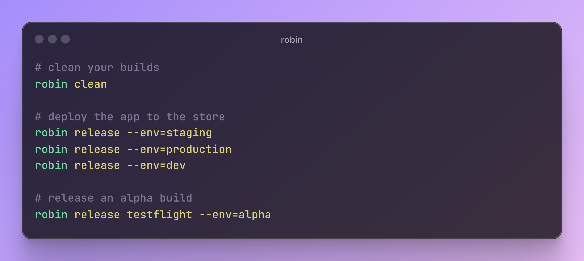

<h1 align="center">robin</h1>
<p align="center">Your own customizable <b>CLI</b> tool</p>
<p align="center">
  <a href="https://github.com/cesarferreira/robin/actions/workflows/node.js.yml"></a>
  <a href="https://www.npmjs.com/package/robin-cli-tool"></a>
  <a href="https://www.npmjs.com/package/robin-cli-tool"></a>
  <a href="https://github.com/cesarferreira/robin/blob/master/LICENSE"></a>
</p>
<p align="center">
  
</p>


## Reason
> Maintaining a simple JSON file with all the available tasks allows for easy customization of deployment, release, cleaning, and other project-specific actions. This ensures that everyone on the team can use, edit, and add tasks on a project level.

## Using robin
The screenshot above was generated based on this `.robin.json`
file at the root of a flutter project:

```json
{
    "scripts": {
      "clean": "flutter clean && rm-rf ./src/gen/",
      "release": "fastlane ios app_distribution release --{{env}} --rollout=1'",
      "release testflight": "fastlane ios release -e={{env}}'"
    }
}
```  

Will result in the following list:

```sh
❯ robin --list
==> clean                 # flutter clean && rm-rf ./src/gen/                               
==> release               # fastlane ios app_distribution release --{{env}} --rollout=1'    
==> release testflight    # fastlane ios release -e={{env}}'             
```


No need to re-generate / compile any code, it will read your `.robin.json` every time you run a command.


## Interactive mode

```sh
robin --interactive # or "-i"
```

We can fuzzy search the available tasks (TODO: replace gif)

<p align="center"></p>


## Install

```sh
npm install -g robin-cli-tool
```

## Usage

```sh
robin init
```

Creates a template `.robin.json` in your current folder.
<!-- We can be smart and insert deploy prod if we detect it's flutter, has fastlane? we can pre-populate -->

```json
{
    "scripts": {
      "clean": "...",
      "deploy staging": "echo 'ruby deploy tool --staging'",
      "deploy production": "...",
      "release beta": "...",
      "release alpha": "...",
      "release dev": "..."
    }
  }
  
```

Example: 
```sh
robin release beta      # Would run your script to release your app to beta
robin deploy staging    # Would deploy your server to staging environment
```


```sh
robin --list              # Lists all the available commands
robin --interactive       # Interactive search for your available commands
```


-----------

## Passing params

By using the following scheme: `{{variable}}` => `--variable=XXX`

This config:
```json
{
    "scripts": {
      "clean": "flutter clean && rm-rf ./output/",
      "release": "ruby deploy_tool --{{env}}'",
      "release testflight": "fastlane ios release -e={{env}}'",
    }
}
```  

Makes this possible:

```sh
# clean your builds
robin clean

# deploy the app to the store
robin release --env=staging
robin release --env=production
robin release --env=dev

# release an alpha build
robin release testflight --env=alpha
```


## IDEAS (not implemented yet)

<!-- Giving the `robin.json`:

```json
{
    "scripts": {
      "deploy staging": "echo 'ruby deploy tool --staging'",
      "deploy production": "echo 'ruby deploy tool --production'",
      "release beta": "...",
      "release alpha": "..."
    }
}
  
```

Writing: 
```sh
robin deploy 
```

Will suggest:
- `robin deploy staging`
- `robin deploy production`

Unless there's a `robin deploy` in your scripts list -->


## Have init templates

```sh
robin init --android
robin init --ios
robin init --flutter
robin init --rails
```
## Add 

```sh
robin add # Adds a command
```

Example: 
```sh
robin add "deploy" "fastlane deliver --submit-to-review" # Adds a deploy command to your current list of commands
```


## Created by
[Cesar Ferreira](https://cesarferreira.com)

## License
MIT © [Cesar Ferreira](http://cesarferreira.com)
