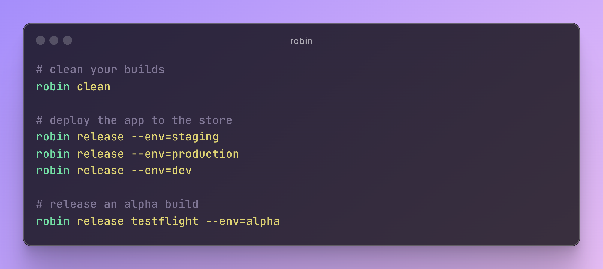

<h1 align="center">robin</h1>
<p align="center">Your own customizable <b>CLI</b> tool</p>
<p align="center">
<a href="https://crates.io/crates/robin_cli_tool"></a>
<a href="https://github.com/cesarferreira/robin/blob/main/LICENSE"></a>


  
</p>
<p align="center">
  
</p>


## Reason
> Maintaining a simple JSON file with all the available tasks allows for easy customization of deployment, release, cleaning, and other project-specific actions. This ensures that everyone on the team can use, edit, and add tasks on a project level.

## Features

- Define and run project-specific tasks via `.robin.json`
- Support for both single commands and command sequences
- Interactive mode with fuzzy search
- List all available tasks
- Add new tasks easily
- Cross-platform support
- Template initialization for different project types
- Variable substitution with default values
- Enum validation for variables
- Migration from script-based to task-based format

## Installation

```bash
# From crates.io
cargo install robin_cli_tool

# From source
cargo install --path .
```

## Usage

### Initialize a new project

```bash
robin init
```

This creates a `.robin.json` file in your current directory with some template tasks.

### Using templates

```bash
# Initialize with a specific template
robin init --template android    # Android project template
robin init --template ios        # iOS project template
robin init --template flutter    # Flutter project template
robin init --template rails      # Ruby on Rails project template
robin init --template node       # Node.js/TypeScript project template
robin init --template nextjs     # Next.js project template
robin init --template python     # Python project template
robin init --template rust       # Rust project template
robin init --template go         # Go project template
```

Each template comes with a curated set of useful commands for that specific platform or framework. For example:

- **Android**: Gradle commands, testing, linting (ktlint), and deployment
- **iOS**: Xcode build, CocoaPods, testing, SwiftLint, and Fastlane commands
- **Flutter**: Build, test, dependency management, and platform-specific commands
- **Rails**: Server, console, database tasks, testing, and code generation
- **Node.js**: Development, testing (Jest), TypeScript, linting (ESLint), and formatting (Prettier)
- **Python**: Virtual env, testing (pytest), linting (flake8), formatting (black), and type checking (mypy)
- **Rust**: Cargo commands for building, testing, linting (clippy), formatting, and documentation
- **Go**: Build, test, linting (golangci-lint), formatting, and dependency management

If a `.robin.json` file already exists, you'll be prompted to confirm before overriding it.

### List all tasks

```bash
robin --list
```

### Interactive mode

```bash
robin --interactive  # or -i
```

### Add a new task

```bash
robin add "deploy" "fastlane deliver --submit-to-review" --description "Deploy to App Store"
```

### Run a command

```bash
robin deploy staging
robin release beta
```

## Configuration

The `.robin.json` file supports both single commands and command sequences:

```json
{
  "tasks": [
    {
      "name": "clean",
      "command": "rm -rf build/",
      "description": "Clean build artifacts"
    },
    {
      "name": "deploy",
      "command": "echo 'ruby deploy tool --{{env=[staging,production]}}'",
      "description": "Deploy to an environment"
    },
    {
      "name": "prep-and-deploy",
      "command": [
        "robin clean",
        "robin build",
        "robin deploy --env=production"
      ],
      "description": "Prepare and deploy to production"
    },
    {
      "name": "full-release",
      "command": [
        "flutter clean",
        "flutter pub get",
        "flutter build ios",
        "cd ios && fastlane beta"
      ],
      "description": "Build and release the iOS app"
    }
  ]
}
```

When using command sequences (arrays):
- Commands are executed in order
- If any command fails, the sequence stops
- Environment variables and working directory are preserved between commands
- Notifications show total execution time for the sequence

## External Configuration

Robin supports including external configuration files, which is particularly useful for monorepos or sharing common tasks across projects:

```json
{
  "include": [
    "../common/robin.base.json",
    "./team-specific.json"
  ],
  "tasks": [
    {
      "name": "local-dev",
      "command": "npm run dev",
      "description": "Run local development server"
    },
    {
      "name": "test",
      "command": "npm run test",
      "description": "Run tests"
    }
  ]
}
```

### Monorepo Example

Here's a typical monorepo structure using shared tasks:

```
monorepo/
├── common/
│   └── robin.base.json        # Shared tasks for all projects
├── frontend/
│   ├── .robin.json            # Frontend-specific tasks
│   └── package.json
├── backend/
│   ├── .robin.json            # Backend-specific tasks
│   └── package.json
└── mobile/
    ├── .robin.json            # Mobile-specific tasks
    └── pubspec.yaml
```

`common/robin.base.json`:
```json
{
  "tasks": [
    {
      "name": "lint",
      "command": "eslint .",
      "description": "Run linter"
    },
    {
      "name": "format",
      "command": "prettier --write .",
      "description": "Format code"
    },
    {
      "name": "docker:up",
      "command": "docker-compose up -d",
      "description": "Start Docker containers"
    },
    {
      "name": "docker:down",
      "command": "docker-compose down",
      "description": "Stop Docker containers"
    },
    {
      "name": "ci:test",
      "command": [
        "npm ci",
        "npm run test"
      ],
      "description": "Run CI tests"
    }
  ]
}
```

`frontend/.robin.json`:
```json
{
  "include": ["../common/robin.base.json"],
  "tasks": [
    {
      "name": "dev",
      "command": "next dev",
      "description": "Start development server"
    },
    {
      "name": "build",
      "command": "next build",
      "description": "Build for production"
    },
    {
      "name": "start",
      "command": "next start",
      "description": "Start production server"
    },
    {
      "name": "deploy:staging",
      "command": [
        "robin docker:down",
        "robin build",
        "robin docker:up"
      ],
      "description": "Deploy to staging environment"
    }
  ]
}
```

## Migrating from scripts to tasks

If you have a legacy configuration with a `scripts` object, you can migrate to the new task-based format:

```bash
robin migrate
```

This will automatically convert your scripts to tasks with descriptions and create a backup of your original file. You can also specify custom paths:

```bash
robin migrate --input path/to/old-config.json --output path/to/new-config.json
```

Or force the migration without confirmation:

```bash
robin migrate --force
```

## Variable Substitution

### Basic Variables
Use `{{variable}}` in your scripts and pass them as `--variable=XXX` when running the command:

```json
{
    "scripts": {
        "deploy": "fastlane {{platform}} {{env}}"
    }
}
```

Then run:
```bash
robin deploy --platform=ios --env=staging
```

### Default Values
You can specify default values for variables using `{{variable=default}}` syntax:

```json
{
    "scripts": {
        "build": "echo \"Building {{mode=debug}}\"",
        "deploy": "echo \"Deploying to {{env=staging}} with version {{version=latest}}\""
    }
}
```

Using default values:
```bash
robin build             # Will use default: debug
robin deploy            # Will use defaults: staging and latest

# Override defaults:
robin build --mode=release                  # Will use: release
robin deploy --env=prod --version=1.0.0     # Will use: prod and 1.0.0
```

### Enum Validation
You can restrict variable values to a specific set using `{{variable=[value1, value2, ...]}}` syntax:

```json
{
    "scripts": {
        "deploy": "echo \"Deploying to {{env=[staging, prod]}}\"",
        "build": "cargo build --{{mode=[debug, release]}}",
        "deploy:app": "fastlane {{platform=[ios, android]}} {{env=[dev, staging, prod]}} --track={{track=[alpha, beta, production]}}"
    }
}
```

Using enum validation:
```bash
# Simple validation
robin deploy --env=staging   # Works: 'staging' is allowed
robin deploy --env=prod      # Works: 'prod' is allowed
robin deploy --env=dev       # Fails: only 'staging' or 'prod' are allowed

# Build modes
robin build --mode=debug     # Works: 'debug' is allowed
robin build --mode=release   # Works: 'release' is allowed
robin build --mode=test      # Fails: only 'debug' or 'release' are allowed

# Multiple validations
robin deploy:app \
    --platform=ios \
    --env=staging \
    --track=beta            # Works: all values are allowed

robin deploy:app \
    --platform=web \        # Fails: 'web' is not in [ios, android]
    --env=staging \
    --track=beta
```

Variables work in both single commands and command sequences:
```json
{
    "scripts": {
        "deploy-sequence": [
            "flutter clean",
            "flutter build {{platform=[ios,android]}}",
            "fastlane {{platform}} beta"
        ]
    }
}
```

## Development Environment

### Doctor Command
The `doctor` command helps verify your development environment is properly set up:

```bash
robin doctor
```

This will check:
- 📦 Required Tools
  - Cargo and Rust
  - Ruby and Fastlane
  - Flutter
  - Node.js and npm
- 🔧 Environment Variables
  - ANDROID_HOME
  - JAVA_HOME
  - FLUTTER_ROOT
- 📱 Platform Tools
  - Android Debug Bridge (adb)
  - Xcode Command Line Tools
  - CocoaPods
- 🔐 Git Configuration
  - user.name
  - user.email

Example output:
```bash
🔍 Checking development environment...

📦 Required Tools:
✅ Cargo: cargo 1.75.0
✅ Rust: rustc 1.75.0
✅ Ruby: ruby 3.2.2
✅ Fastlane: fastlane 2.217.0
❌ Flutter not found
✅ Node.js: v20.10.0
✅ npm: 10.2.3

🔧 Environment Variables:
✅ ANDROID_HOME is set
✅ JAVA_HOME is set
❌ FLUTTER_ROOT is not set

📱 Platform Tools:
✅ Android Debug Bridge (adb): Android Debug Bridge version 1.0.41
✅ Xcode Command Line Tools: installed
✅ CocoaPods: 1.14.3

🔐 Git Configuration:
✅ Git user.name is set
✅ Git user.email is set
```

### Update Development Tools
To update all development tools to their latest versions:

```bash
robin doctor:update
```

This will update:
- Rust (via rustup)
- Flutter
- Fastlane (via gem)
- Global npm packages
- CocoaPods repositories

## License

MIT © [Cesar Ferreira](http://cesarferreira.com)